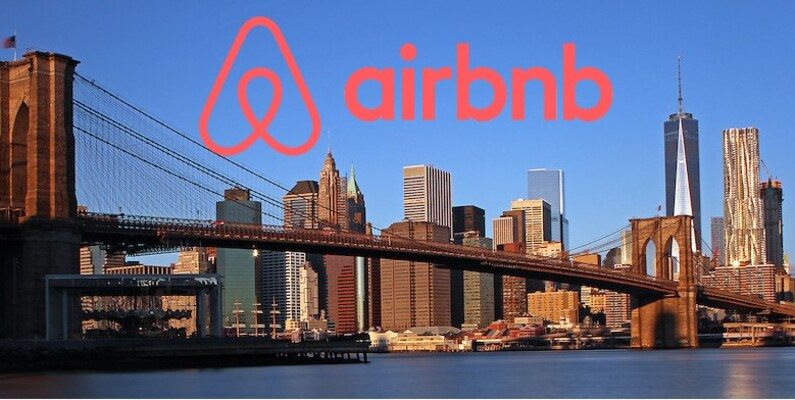

# Midterm_project_ML_ZoomCamp_2024

## Project Overview: 
This project analyzes the New York City Airbnb dataset and builds a Machine Learning model to predict rental prices. Completed as part of the ML Zoomcamp course from DataTalksClub. 
The project includes detailed steps in data preparation, exploratory data analysis (EDA), model training (including neural networks), model tuning, deployment, and reproducibility, aligned with project requirements.

## Problem Description: 
Airbnb prices can vary significantly based on various factors like location, room type, and availability. This project aims to predict the rental price based on these factors, assisting hosts in optimizing pricing strategies and helping users find cost-effective options.

## Dataset: 

- **Source**: [Kaggle - New York City Airbnb dataset](https://www.kaggle.com/datasets/dgomonov/new-york-city-airbnb-open-data)

- **Description**: This dataset includes detailed information about Airbnb listings in New York City, featuring attributes.

- **Instructions**: Download the dataset directly from Kaggle using the provided link or follow instructions within this repository for loading the data.
